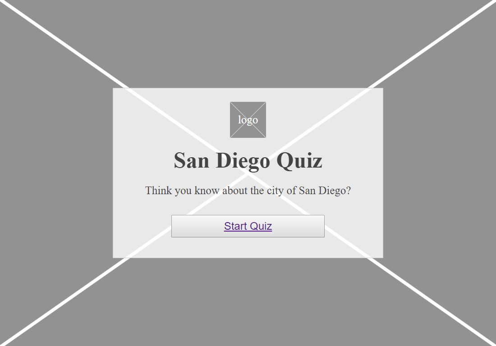
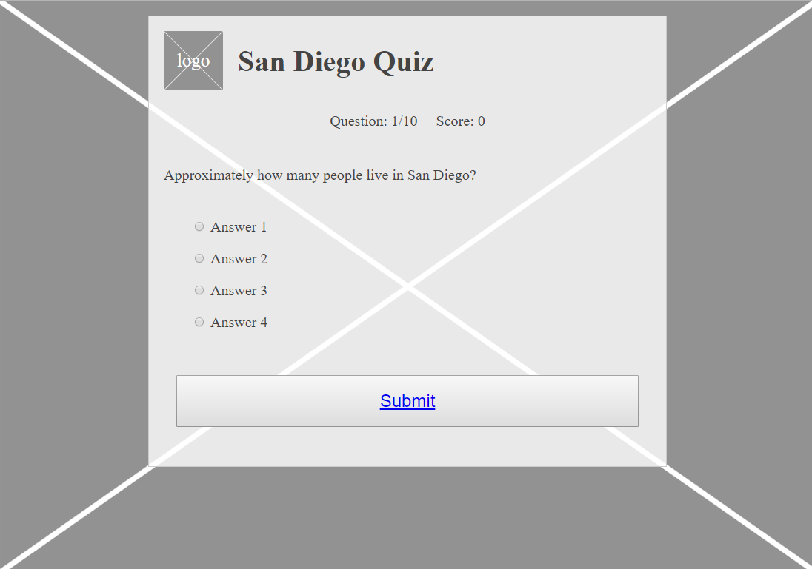
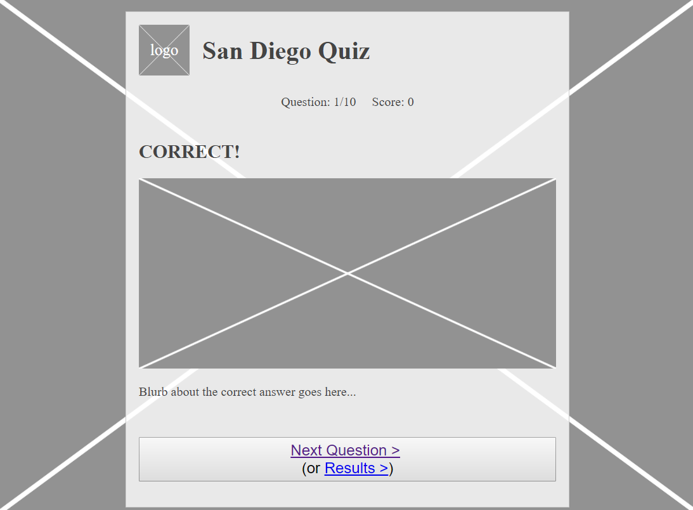
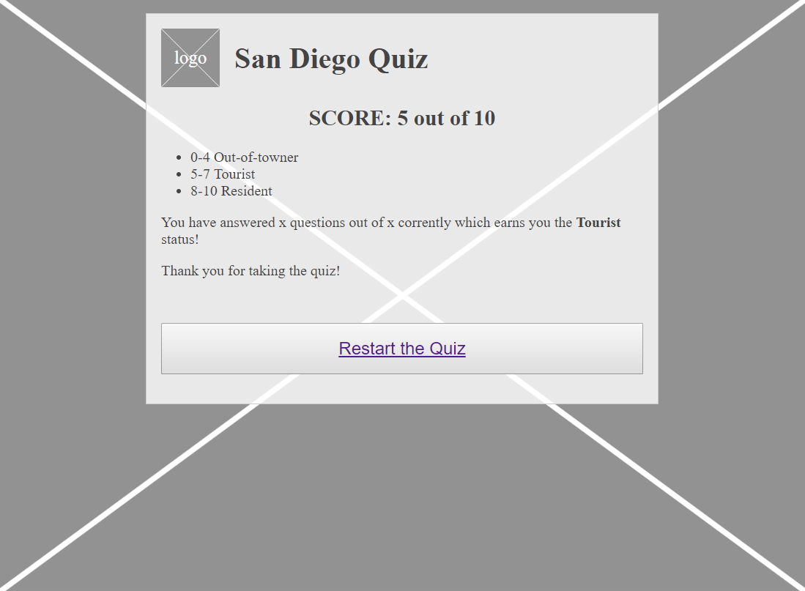
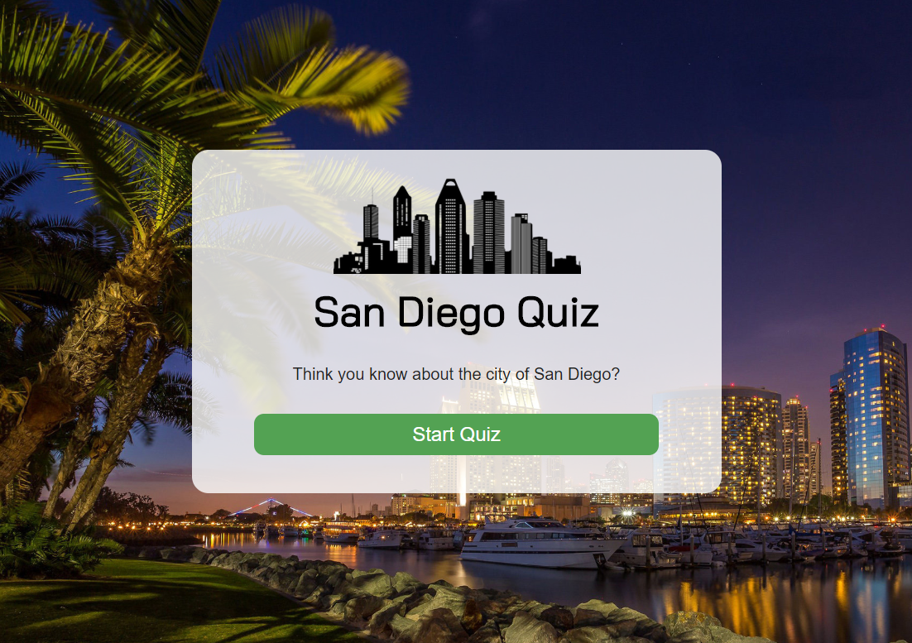
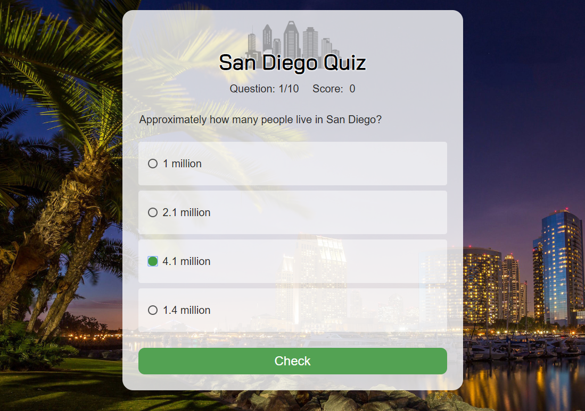
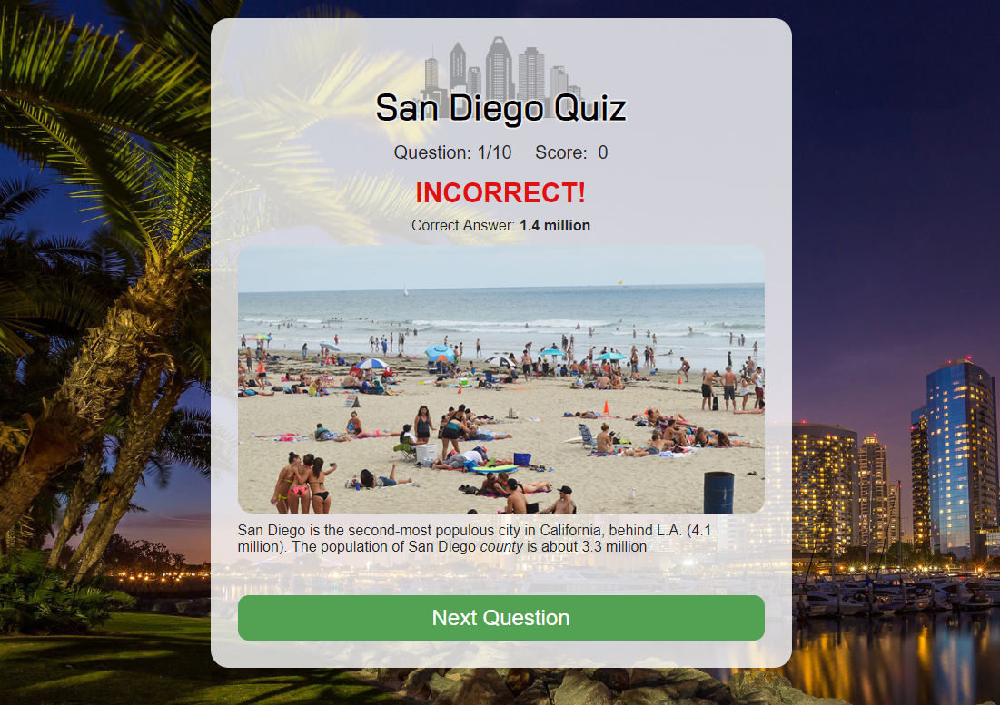
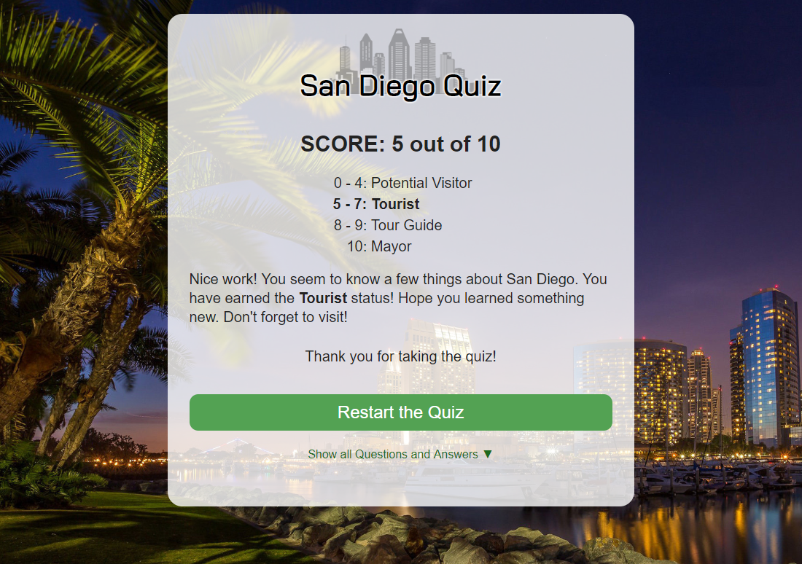

# San Diego Quiz app

"San Diego Quiz" is a fully responsive app that quizzes the user about the city of San Diego. When finished, it will calculate and display the user's score along with a level of expertise scale.

# Demo

* [Live Demo](https://george-apazidis.github.io/san-diego-quiz/index.html)

## User flow & Wireframes

* The starting screen has a button that users can click to start the quiz.

* Users are prompted through a series of multiple choice questions that they can answer.
* Users are able to see which question they're on (for instance, "7 out of 10") and their current score ("5 correct, 2 incorrect").

* Upon submitting an answer, users:
   * receive textual feedback about their answer. If they were incorrect, they are informed of the correct answer.
   * are provided a button to move onto the next question
   

* Users are shown their overall score at the end of the quiz. In other words, how many questions they got right out of the total questions asked.
* Users are be able to start a new quiz.

## Screenshots

Landing page:

Question page:

Answer page:

Results page:

## Technology

* HTML5
* CSS3
* JavaScript
* jQuery

## Development Road Map

Features for future iterations include:
* Integrating a timer for each question
* Creating a point system where points are based off how much time it took to answer
* Implement social sharing on results page
  * "I scored a 7.8 on the San Diego quiz! Can you beat me? Try the quiz [link]"